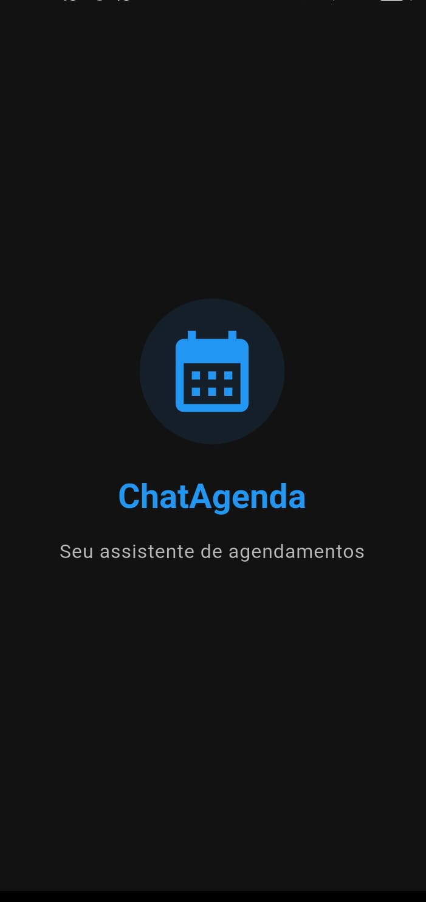
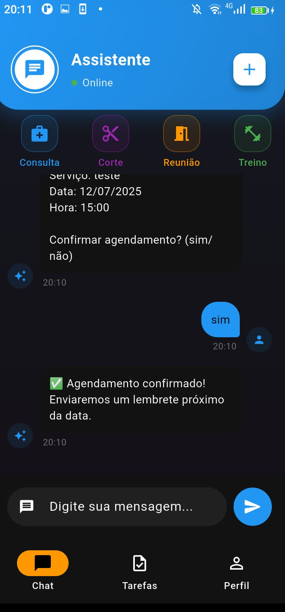
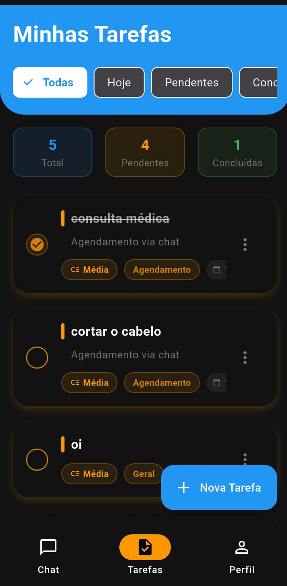
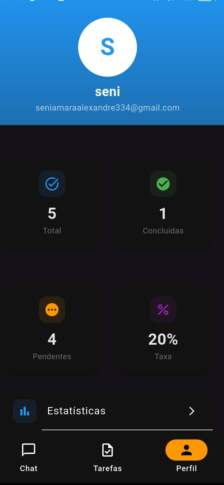

#  ChatAgenda - Assistente de Agendamentos

<div align="center">
  
  
  
  
  
  

  
  
  
  
</div>

## Sobre o Projeto

**ChatAgenda** é um assistente virtual inteligente que permite usuários realizarem agendamentos através de uma interface de chat conversacional. Com integração completa com Firebase, o app oferece autenticação segura, armazenamento em tempo real e uma experiência fluida e intuitiva.

###  Funcionalidades Principais

| Funcionalidade | Descrição |
|----------------|-----------|
|  **Chat Inteligente** | Assistente que entende comandos de agendamento |
|  **Autenticação** | Login com Email/Senha e Google |
|  **Gerenciamento de Tarefas** | CRUD completo de agendamentos |
|  **Estatísticas** | Gráficos de produtividade |
|  **Tema Escuro/Claro** | Alternância automática |
|  **Responsivo** | Funciona em qualquer tamanho de tela |

##  Capturas de Tela

<div align="center">
  
  | Tela Inicial | Chat | Tarefas | Perfil |
  |:------------:|:----:|:-------:|:------:|
  |  |  |  |  |
  
</div>

##  Tecnologias Utilizadas

### Frontend (Flutter)
- **Flutter 3.16** - Framework principal
- **GetX** - Gerenciamento de estado e rotas
- **Provider** - Gerenciamento de temas
- **Fl Chart** - Gráficos e visualizações
- **Percent Indicator** - Indicadores circulares

### Backend (Firebase)
- **Firebase Auth** - Autenticação de usuários
- **Cloud Firestore** - Banco de dados NoSQL
- **Firebase Storage** - Armazenamento de imagens
- **Firebase Messaging** - Notificações push

##  Estrutura do Projeto

```
lib/
├── main.dart
├── core/                    # Configurações e serviços
│   ├── constants/           
│   │   └── app_colors.dart  # Cores do app
│   ├── services/            
│   │   ├── auth_service.dart # Firebase Auth
│   │   └── task_service.dart # Firestore
│   └── theme/               
│       └── theme_provider.dart # Tema dinâmico
├── controllers/              # Lógica de negócios
│   ├── auth_controller.dart
│   ├── chat_controller.dart
│   └── task_controller.dart
├── models/                   # Modelos de dados
│   ├── user_model.dart
│   └── task_model.dart
├── screens/                  # Telas do app
│   ├── auth/
│   │   ├── splash_screen.dart
│   │   ├── login_screen.dart
│   │   └── register_screen.dart
│   └── home/
│       ├── home_screen.dart
│       ├── tasks_screen.dart
│       ├── statistics_screen.dart
│       └── settings_screen.dart
└── widgets/                  # Componentes reutilizáveis
    ├── custom.dart
    ├── message_bubble.dart
    └── task_card.dart
```

##  Configuração do Firebase

### 1. Criar Projeto no Firebase
```bash
1. Acesse https://console.firebase.google.com/
2. Clique em "Adicionar projeto"
3. Nome: chatagenda
4. Desabilite Google Analytics (opcional)
```

### 2. Registrar App Android
```
Package name: com.seuapp.chatagenda
App nickname: ChatAgenda
Baixar google-services.json
```

### 3. Colocar Arquivo no Projeto
```bash
# Mover para a pasta correta
mv ~/Downloads/google-services.json android/app/
```

### 4. Ativar Autenticação
```
Firebase Console → Authentication → Sign-in method
Habilitar: Email/Senha e Google
```

### 5. Criar Firestore
```
Firebase Console → Firestore Database → Criar banco
Modo: Produção
Local: southamerica-east1 (São Paulo)
```

## 📦 Instalação

### Pré-requisitos
- Flutter SDK (>=3.16.0)
- Android Studio / VS Code
- Git
- Conta no Firebase

### Passos

```bash
# Clone o repositório
git clone (https://github.com/seniamara/chatagenda/)

# Entre no diretório
cd chatagenda

# Instale as dependências
flutter pub get

# Configure o Firebase
# Coloque o google-services.json em android/app/

# Execute o app
flutter run
```

##  Funcionalidades Detalhadas

### 💬 Assistente de Chat
- Interpretação de linguagem natural
- Fluxo de agendamento guiado
- Sugestões de ações rápidas
- Histórico de conversas

### 📅 Gerenciamento de Tarefas
- Criar/Editar/Excluir agendamentos
- Categorias personalizadas
- Prioridades (Baixa, Média, Alta, Urgente)
- Filtros por data e status

### 📊 Estatísticas
- Progresso diário/semanal/mensal
- Gráfico por categoria
- Sequência de produtividade
- Taxa de conclusão

###  Perfil do Usuário
- Informações pessoais
- Metas personalizadas
- Configurações de notificações
- Tema escuro/claro

## 🤝 Como Contribuir

1. Faça um fork do projeto
2. Crie uma branch (`git checkout -b feature/nova-funcionalidade`)
3. Commit suas mudanças (`git commit -m 'Adiciona nova funcionalidade'`)
4. Push para a branch (`git push origin feature/nova-funcionalidade`)
5. Abra um Pull Request

## 📄 Licença

Este projeto está sob a licença MIT. Veja o arquivo [LICENSE](LICENSE) para mais detalhes.
```

```
### 📞 Contato

**Desenvolvedor:** seniamara Benedito
- 📧 Email: seniamaraa@gmail.com
- 💼 LinkedIn: www.linkedin.com/in/seniamara-benedito-04630731b

**Link do Projeto:** https://github.com/seniamara/chatagenda/
